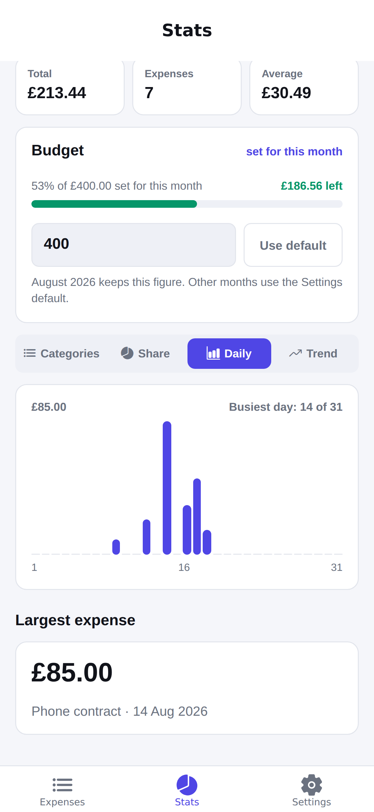

# Spendly

Spendly is an offline expense tracker for Android and iOS, built with React Native
and Expo. You record what you spend, sort it into categories, and see where your
money goes each month against a budget you set. There is no backend and no
account: every expense stays in the storage of your own phone.

---

## Installation and how to run it

You need Node.js and the Expo Go app on your phone. Development used Node
v24.10.0. There is no API key, no backend and no environment file to set up.

```bash
git clone <repository-url>
cd spendly
npm install
npx expo start
```

Open Expo Go on your phone and scan the QR code in the terminal. The app opens
directly. To run it on a simulator instead, press `i` for iOS or `a` for Android
in the same terminal.

To run the tests:

```bash
npm test
```

The full test report, including the manual test runs, is in
[TESTING.md](TESTING.md).

---

## Features

| Feature | What it does |
|---|---|
| **Multi-screen navigation** | Three bottom tabs (Expenses, Stats, Settings) built with Expo Router. A stack sits above the tabs: the add form opens on it as a modal (`app/expense/new.js`) and the edit screen opens through the dynamic route `app/expense/[id].js`. |
| **State management with the Context API** | Two React contexts hold all state. `ExpensesContext` holds the list and its create, update and delete actions, and uses `useReducer` with a pure reducer. `SettingsContext` holds the currency, the theme and the budgets. |
| **Persistence with AsyncStorage** | The app reads the saved data once when it starts, and writes it back after every change. Your expenses and settings survive a force-quit and a restart of the phone. |
| **Works offline** | There is no network call anywhere in the app. Spendly works the same in aeroplane mode. |
| Add an expense | An "Add expense" button floats over the Expenses list and opens the form as a modal. Enter an amount, pick one of seven categories, add an optional note, and pick a date. The form rejects an empty amount and a negative amount. |
| Native date picker | The date opens a calendar, with "Today" and "Yesterday" buttons for the common cases. The calendar cannot offer a date that does not exist, so a typed date such as `2026-02-31` is no longer possible. |
| Four currencies with conversion | GBP, USD, EUR and MVR. Every expense keeps the currency you entered it in, and the app converts it for display. An expense of 10 US dollars reads as 154.20 rufiyaa once you switch to MVR. Budgets convert with it. |
| The rufiyaa sign | The rufiyaa has no sign in Unicode, so the app draws the official Maldives Monetary Authority outline with SVG rather than a font character. |
| Edit and delete | Tap any row to open it. Change it and save, or delete it after a confirmation alert. |
| Expense list by day | The list groups expenses under "Today", "Yesterday" and full dates, newest first. |
| Category filter | A chip bar filters the list to one category. An empty category shows its own message. |
| Monthly total and budget bar | The header shows what you spent this month. The bar below it turns green, amber at 80% and red at 100% of your budget. |
| Budget for a single month | Every month can hold its own budget. A month with no figure of its own uses the default from Settings, so a holiday month does not force you to change the default and change it back. |
| Four ways to read a month | The Stats tab switches between Categories, Share, Daily and Trend. Categories and Share show where the money went, Daily shows when it went, and Trend compares the last six months. |
| Expenses behind a category | Tap a category on the Stats tab to open it and see the expenses that make up the figure. Tap one of them to edit it. |
| Settings | Theme (System, Light or Dark), currency (GBP, USD, EUR or MVR), the default monthly budget, and a destructive "Clear all expenses" action. |
| Light and dark themes | Every colour comes from one theme file. The whole app, the headers and the tab bar change together. |
| Accessibility | Buttons, chips, inputs and the budget bar carry accessibility roles, labels and states for screen readers. |

---

## Screenshots

<table>
  <tr>
    <td align="center" width="50%">
      <br>
      <b>Expenses (light)</b><br>
      The month total, the budget bar, the category filter and the list grouped by day.
    </td>
    <td align="center" width="50%">
      <br>
      <b>Expenses (dark)</b><br>
      The same screen after you set the theme to Dark in Settings.
    </td>
  </tr>
  <tr>
    <td align="center">
      <br>
      <b>Add</b><br>
      The floating button opens the form as a modal over the tabs.
    </td>
    <td align="center">
      <br>
      <b>Edit</b><br>
      The same form opened from the list, with a delete action.
    </td>
  </tr>
  <tr>
    <td align="center">
      <br>
      <b>Stats — Categories</b><br>
      The budget for the month, and bars that open to show the expenses behind them.
    </td>
    <td align="center">
      <br>
      <b>Stats — Share</b><br>
      A ring chart of the share each category takes of the month.
    </td>
  </tr>
  <tr>
    <td align="center">
      <br>
      <b>Stats — Daily</b><br>
      One bar for every day of the month, with the peak figure and the busiest day.
    </td>
    <td align="center">
      <br>
      <b>Stats — Trend</b><br>
      Spending over the six months that end with the selected month.
    </td>
  </tr>
  <tr>
    <td align="center">
      <br>
      <b>Settings</b><br>
      Theme, currency, the default budget and the clear-all action.
    </td>
    <td align="center">
      <br>
      <b>Empty state</b><br>
      What a new user sees before the first expense.
    </td>
  </tr>
</table>

---

## How it works

**Navigation.** `app/_layout.js` mounts both providers and a root stack. Inside
it, `app/(tabs)/_layout.js` holds the three tabs. Because the add and edit
screens belong to the root stack and not to the tab group, they open as modals
over the tab bar: adding an expense is an action, not a fourth place to browse.

**State.** The expense list lives in `ExpensesContext`, which drives every change
through the pure reducer in `src/context/expensesReducer.js`. The reducer keeps
the list sorted newest first, so no screen has to sort on render. Settings sit in
their own context because they change far less often, and keeping them apart
stops a currency change from re-rendering the whole list through one value
object.

**Persistence.** Each context reads its key from AsyncStorage once on mount and
writes back after every change. The write is held back until that first read has
finished, so a slow or failed read can never save an empty list over real data.
`src/utils/storage.js` wraps every call in try/catch and returns an `ok` flag
instead of throwing.

**Currency.** An expense stores the amount as it was typed and the currency it
was typed in. Nothing is rewritten when the user switches currency; the
conversion happens on the way to the screen, in `src/constants/rates.js`. Budgets
are held in one base currency for the same reason, so a budget of 400 keeps its
value rather than its digits.

---

## Technologies used

| Technology | Use |
|---|---|
| React Native 0.86 | The UI framework. |
| Expo SDK 57 | The toolchain and the runtime. The app runs in Expo Go with no native build. |
| Expo Router 57 | File-based navigation: bottom tabs, a stack, a modal and a dynamic route. |
| React Context + `useReducer` | State management for the expense list and the user settings. |
| AsyncStorage 2.2.0 | Local storage on the phone. |
| @expo/vector-icons (Ionicons) | All icons in the tab bar, the category grid and the list. |
| react-native-svg 15.15.4 | The ring chart, the trend line and the rufiyaa sign. The daily bar chart uses plain Views and needs no library. |
| @react-native-community/datetimepicker 9.1.0 | The calendar for the date field. Expo Go carries this module already, so it adds no native build step. |
| Jest + jest-expo | The unit tests for the reducer and the helpers. |

---

## Project structure

```
app/                          Routes (Expo Router)
  _layout.js                  Root stack: providers, themed header, modal routes
  (tabs)/_layout.js           Bottom tab navigator
  (tabs)/index.js             Expenses: month total, budget bar, filter, list,
                              and the Add expense button
  (tabs)/stats.js             Stats: month switcher, budget, four chart views
  (tabs)/settings.js          Settings: theme, currency, budget, clear all
  expense/new.js              Add screen (opens as a modal)
  expense/[id].js             Edit screen (dynamic route, opens as a modal)
src/
  components/                 ScreenContainer, EmptyState, ErrorBanner,
                              ExpenseItem, CategoryChips, BudgetBar, ExpenseForm,
                              AddExpenseButton, MonthBudgetCard,
                              CategoryBreakdown, CategoryDonut, DailyBars,
                              TrendLine, Money, CurrencySign, RufiyaaSign
  constants/categories.js     The seven categories and the four currencies
  constants/rates.js          Fixed exchange rates and the conversion helper
  context/expensesReducer.js  Pure reducer for the list
  context/ExpensesContext.js  Provider, CRUD actions, storage
  context/SettingsContext.js  Provider for currency, theme and budgets
  theme/index.js              Light and dark palettes, spacing and radius scales
  utils/format.js             Money and date formatting, input validation
  utils/storage.js            AsyncStorage wrappers that never throw
__tests__/                    Jest unit tests
assets/screenshots/           The images in this README
TESTING.md                    The test report
```

---

## Known issues and future improvements

- **No cloud sync and no multiple devices.** The data lives on one phone. If you
  delete the app, the data goes with it.
- **No export.** There is no CSV or PDF export of the expenses.
- **No recurring expenses.** You must enter a monthly bill again each month.
- **The categories are fixed.** You cannot add, rename or remove a category.
- **No budget per category.** A month holds one figure. You cannot cap food or
  transport on their own.
- **No search.** The category filter is the only way to reduce the list.
- **The Add button is only on the Expenses tab.** From Stats or Settings you
  must go back to Expenses to record something.
- **The exchange rates are fixed in the code.** The app works offline, so it
  cannot ask a rate service. `src/constants/rates.js` holds the figures and the
  date they were taken. The rufiyaa is pegged to the US dollar, so that pair
  stays right. The pound and the euro float, so their figures drift.
- **Editing rewrites the currency of an expense.** The form works in the
  currency you have chosen. If you open an expense recorded in dollars while
  the app shows rufiyaa, saving it stores it in rufiyaa at the converted
  amount.

---

## Reflection

The scaffold made the two contexts and the theme system look easy, but the real
work started when the app first ran on a phone. Two route files were declared in
the navigators before they existed, so the app could not open at all. That was a
good lesson: with file-based routing, a screen that a navigator names must exist,
or nothing renders.

State management was the part I understood best by the end. Splitting the state
into two contexts was the right choice. The settings change rarely, and keeping
them apart from the expense list stops a currency change from re-rendering
everything through the same value object. Putting all list logic in a pure
reducer also paid off twice: the screens stay simple, and I could test every
state change without a renderer or a storage mock.

Persistence looked like the easy part and was the part I trusted least. Writing
to storage on every change is simple, but the write has to wait for the first
read to finish. I got that half right at first: I held the write back while the
read was still running, but not when the read failed, which left a path where an
unreadable file could be saved over with an empty list. Testing it properly meant
a force-quit and a restart, not a reload. A reload keeps the process alive and
proves nothing.

Testing found real defects that clicking through the happy path never would have.
A unit test showed that `parseAmount` stripped the minus sign before the "more
than zero" check, so `-4` became `4`. Manual testing showed that a date error
stayed on screen after I corrected the date. Reading the code again at the end
found a migration that could never run, because the block that filled in missing
settings supplied the very version number the check was looking for.

File-based routing caught me a second time when I moved the add form out of the
tabs and into a modal. I left a placeholder route at `app/(tabs)/add.js` and put
the modal at `app/add.js`. Both resolve to `/add`, because a group in brackets
does not appear in the path, so the button opened a blank screen instead of the
form. Moving the modal to `/expense/new` fixed it and reads better next to
`/expense/[id]`.

If I did this again, I would build one full screen end to end before I wrote any
other screen. I wrote most of the UI before I ran the app once, and a first run
much earlier would have found the missing routes in minutes instead of at the end.
